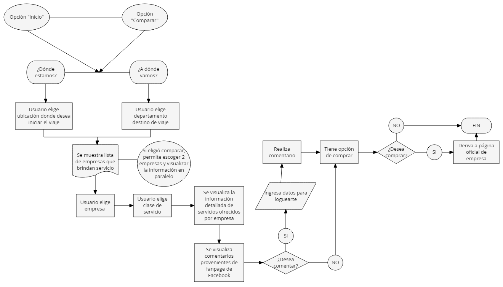
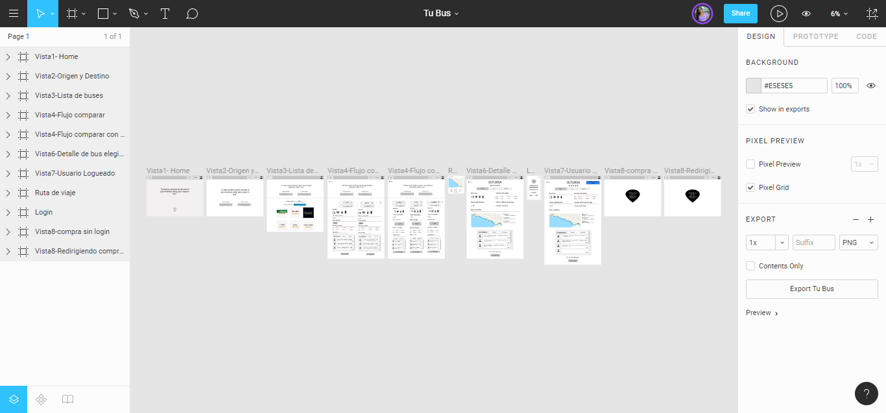
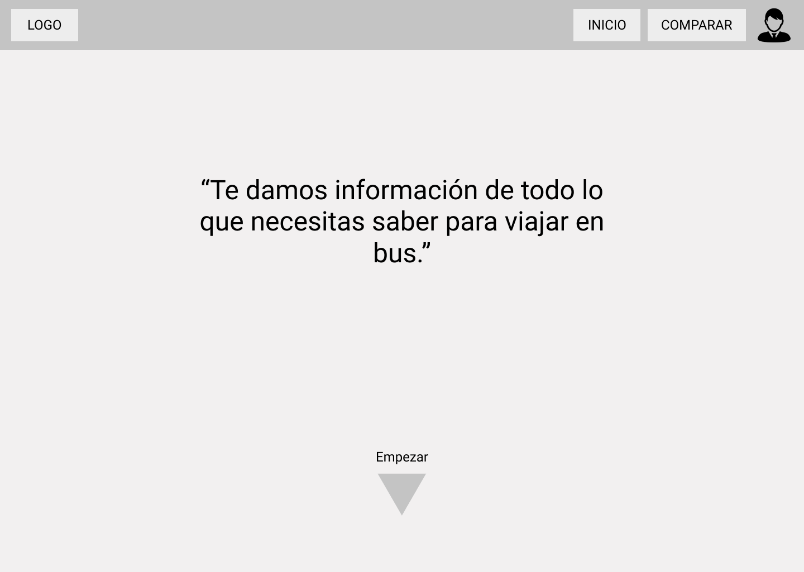
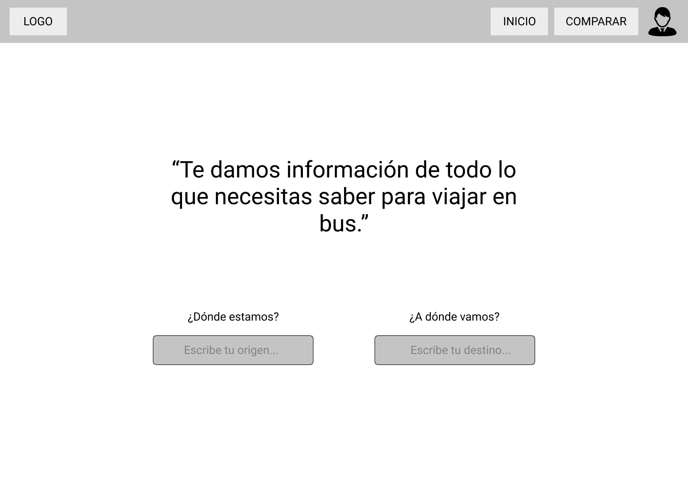
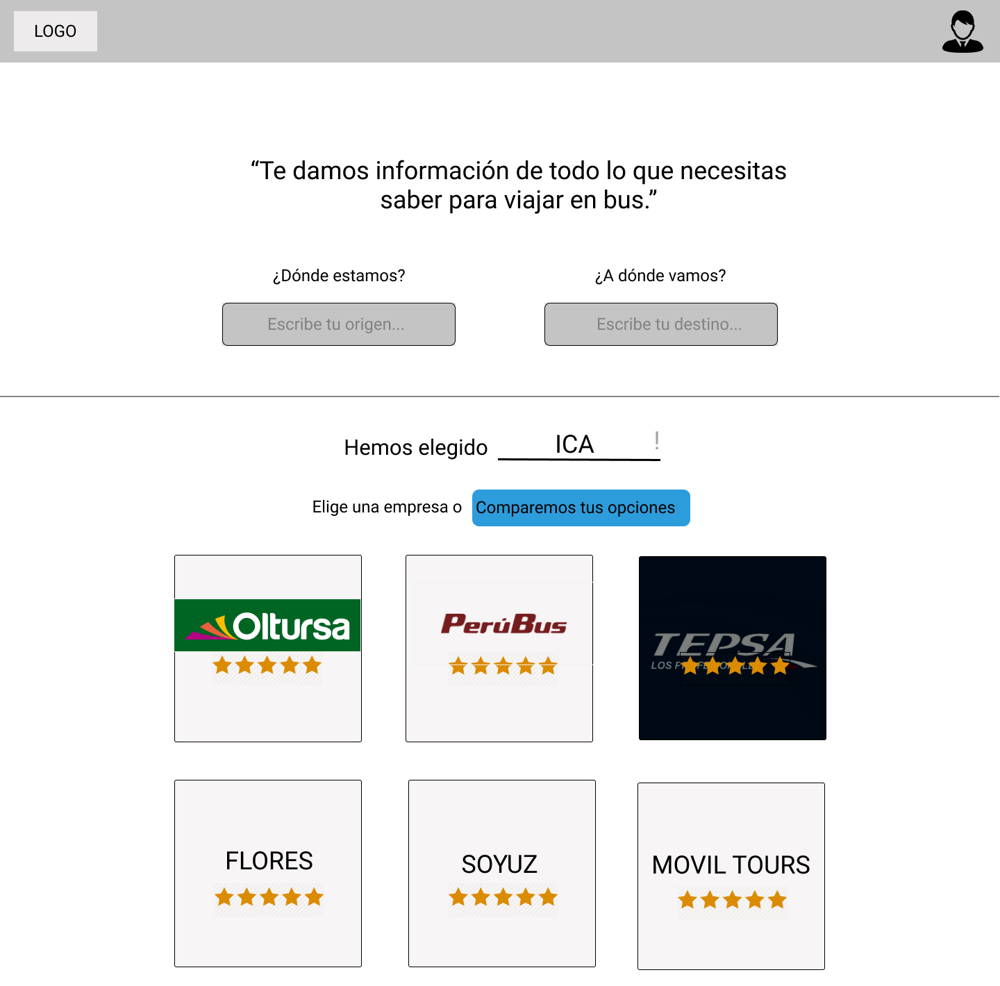
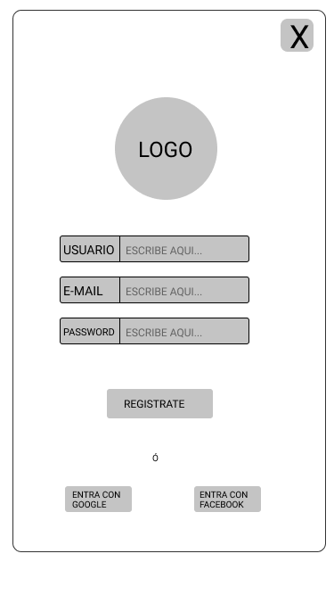

# Proyecto: NUEVA EXPERIENCIA EN EMPRESAS DE BUSES

## Equipo Ying-Yang Design

* Nataly Cortez
* Karina Buhezo
* Andrea Encarnación
* Isabel Chávez
* Shannon Rivera
* Ada Yajahuanca

### EL RETO:
Nos ha contactado Catalina una emprendedora viajera con una idea de negocio. Durante sus últimas vacaciones Catalina estuvo viajando por todo latinoamérica. Durante estos viajes Catalina tuvo que tomar muchos buses de todo tipo para llegar a ver los paisajes más lindos del continente.
Durante sus viajes Catalina se dió cuenta que existen aún muchas oportunidades para mejorar la experiencia de todos los usuarios de este tipo de transporte: horarios, embarques, desembarques, compra de tickets en los terminales, compra de tickets online, cancelaciones, cambios de pasajes, etc.
Adicionalmente, Catalina se dio cuenta que todas las plataformas de venta de tickets de bus tienen cosas por mejorar en Chile, Perú y México.
Luego de vivir todo esto, Catalina está pensando en emprender en este sector. Para ello ha contratado a tu squad para que la ayude a investigar más sobre los usuarios de este tipo de transportes y para que definan y prueben un MVP.
Con tu asesoría, ella podrá sustentar su idea de negocio a un grupo de inversión y así obtener el financiamiento necesario para emprender su negocio y mejorar la experiencia en este rubro.

### PLANIFICACIÓN:

_**HERRAMIENTAS**_

*[Trello](https://trello.com/b/AmqGLK3O/nueva-experiencia-en-empresas-de-buses)

## NUESTRO PROCESO UX :

## Descubrimiento e investigación:

_**Observación contextual:**_

Se realizó una observación contextual en  los terminales de autobuses y áreas concurridas para conocer el comportamiento de los usuarios, aqui se pudo descubrir lo siguiente:

* Los usuarios desean que se les apoye en el embarque y desembarque de equipaje, buscan personal para eso.
* Mostraban incomodidad e impaciencia por las demoras  en los buses.
* Los usuarios escuchaban atentos a los parlantes para evitar perder el bus.

_**Encuestas:**_
* Encuestas presenciales y [online](https://docs.google.com/forms/d/1spEVI_2zr-XjkvmiQ4f6wRZsXpssyU4BUgmFTvxz60I/viewform?edit_requested=true) en terminales de bus y lugares concurridos
Se realizó una encuesta de 4 minutos a las personas con las siguientes preguntas:

_**País:**_

_**Sexo:**_

_**Edad:**_

_**¿A qué se dedica actualmente?**_

_**¿Con que frecuencia realiza un viaje en bus?**_

_**¿Cuál es el medio por el que adquiere generalmente sus boletos cuando viaja?**_

_**¿Qué le llevo a elegir ese medio?**_

_**¿Cuál es el motivo principal por el que realiza un viaje?**_

_**En general ¿ Cómo calificaría usted su experiencia viajando en bus?**_

_**¿Por qué lo califica usted de ese modo?**_

_**¿Qué busca usted en un servicio de bus?**_

_**¿Qué sugerencia le daría usted a las empresas de bus para mejorar su experiencia de viaje?**_

* Opiniones en foros de las páginas:

## Síntesis y definición:

_**AFFINITY MAPPING:**_

1.	Analizamos las respuestas de los encuestados entre los miembros del equipo.

2.	Cada miembro del grupo analizó las ideas en tarjetas de forma individual.

3.	Luego del análisis de ideas, se recolectaron las tarjetas para que éstas sean expuestas aleatoriamente.

4.	Agrupamos las ideas por “afinidad mutua”.

5.	En cada grupo de ideas, colocamos un título en común mediante una discusión en grupo.

6.	Dibujamos el diagrama de afinidad, en el que se situamos las ideas a medida que eran agrupadas.

7.	Por último, discutimos como quedan los grupos y los elementos correspondientes al tema.

**Temas encontrados:**

* Seguridad

"Que desaparezcan que haya solo aviones . Más seguridad en robos , pasajeros en la carretera .
Paradas inesperadas."

* Horarios y puntualidad

"Que sean puntuales en la hora de salida y de llegada."

* Atención al cliente

"Que siempre tengan una terramoza y buena atención."

* Servicios en el bus

"No te dan adicionales como comida."

* Estado de las unidades

"Brindar buenas unidades y asientos."

* Comodidad en el bus

"Siempre es incómodo viajar muchas hora en el bus y no hay alguien que se preocupe por tu comodidad"

* Compra online

"Si compro con anticipación me sale con descuento e inclusive aveces hay promociones."

* Precio

"Barato y buenos buses"

* Compra presencial

"No confío en compras online"

### PRESENTACIÓN DEL PROBLEMA:
Luego de analizar las respuestas de las encuestas presenciales, rescatamos que los usuarios tomaban mucha importancia al tema de la seguridad, además, que el servicio cumpla con los horarios establecidos para las salidas y llegadas, atención al cliente y servicios en el bus.

Por lo tanto, apoyándonos en el mapa de afinidad en el cual agrupamos todos estos temas concluimos que aquellos que poseían mayor cantidad de post-it son los problemas más relevantes (seguridad y cumplimiento de horarios).
 > “La falta de información detallada en servicios, rutas,  paradas y recomendaciones acerca de los servicios que brindan las empresas de transporte terrestre interprovincial.”

### USER PERSONAS:
**User Persona primary**

**User persona secondary**

**Served persona**

### CUSTOMER JOURNEY MAPS:

**-Usando el producto**

### PROBLEM STATEMENTS:

### HMW (HOW MIGHT WE o Cómo podríamos):

1.    _**HMW** mostrar las rutas y paradas de los buses a los pasajeros?_

2.    _**HMW** hacer que las paradas sean aprovechadas por los pasajeros?_

3.    _**HMW** mostrar la información de los servicios del bus a los pasajeros?_

4.    _**HMW** comparar los servicios de los buses entre ellos?_

5.    _**HMW** intercambiar información y recomendaciones de las empresas de bus entre usuarios?_

6.    _**HMW** validar la información que dan las empresas acerca de sus servicios?_

7.    _**HMW** mostrar la información del clima, accidentes, retrasos a los pasajeros en tiempo real?_

8.    _**HMW** dar atención personalizada a nuestros usuarios?_

9.    _**HMW** que los usuarios verifiquen el buen estado de los buses?_

10.    _**HMW** que los usuarios se mantengan informados acerca de los horarios de llegada y salida de los buses?_

### WHAT IF:

1.    What if no necesita comparar con otras empresas porque esta fidelizado sólo con una?

2.    What if el bus no hace paradas?

3.    What if la terramoza indica lo que pueden encontrar en cada parada?

4.    What if colocamos un módulo de atención al pasajero para consultas de los servicios?

5.    What if los pasajeros buscan referencias con los demás pasajeros al momento de hacer la compra del pasaje?

6.    What if los pasajeros buscan información del clima en los servicios meteorológicos?

7.    What if los pasajeros tienen asistentes?

8.    What if SUTRAN verifica el estado de los buses antes de la partida?

9.    What if los buses salen todas las horas?

## Ideación:
### FEATURE LIST:

* Mostrar un mapa con la ruta y sus paradas en el viaje.

* Mostrar lo que puede encontrar en cada parada del viaje.

* Mostrar en un cuadro las características y los servicios que ofrece el bus.

* Mostrar un cuadro con las características técnicas y estado del bus.

* Brindar una opción para comparar el bus elegido con otros.

* Visualizar las recomendaciones y valoraciones  que dan los usuarios acerca de los servicios recibidos en el bus.

* Crear un zona en la que se muestre los comentarios asociados a los fan pages y páginas web de cada empresa de bus.

* Crear un logueo en el caso que deseemos comentar, puntuar o valorar.

* Brindar información en tiempo real de inconvenientes con los viajes.

### PRIORIZACION:

### STORYBOARD:

### STORYTELLING USER PERSONA PRIMARIO
## Las vacaciones soñadas
Emilia es una persona a la cual le gustaría conocer todos los rincones del Perú, ella ahorra la mayor parte de sus ingresos para lograrlo.

Cierto día ella recibe una llamada del Gocta Lodge Hotel indicándole que ha ganado un premio.
Su interlocutor le dijo: “Srta. Emilia usted se ha hecho acreedora a nuestro servicio de hospedaje 5 estrellas en nuestras instalaciones, el hospedaje incluye: 3 días y 2 noches en una suite matrimonial para usted y un acompañante. Adicional a esto le otorgamos un tour completo a todos los atractivos turísticos del lugar, incluyendo la catarata de Gocta”
Ella responde anonadada: ¡Gracias!  ¿Cómo hago para reclamar el premio? ¿Cuáles son las fechas disponibles?
A lo que el interlocutor le responde que hay ciertas fechas disponibles y la más próxima es del 26 al 29 de marzo. En caso desee confirmar la reserva debe enviar los documentos de identidad de su acompañante y el suyo para realizarla. Por último, le indica que deben llegar al lugar las dos personas para que le otorguen el premio.
Emilia confirma las fechas a su interlocutor y esa misma tarde se comunica con su mejor amiga para proponerle que sea su acompañante.

Dajiana, su amiga le indica que ella sale de vacaciones el 25 por lo tanto que demorará un día en llegar al hotel porque el viaje demora usualmente 48 horas.
En ese momento Emilia se inquieta debido a que es necesario que las dos se encuentren en el hotel para que el premio sea válido.
En ese momento Dajiana le indica que irá manejando su auto para que la duración del viaje disminuya considerablemente y llegar a tiempo al lugar.
Emilia se tranquiliza al obtener esa respuesta por parte de su amiga realiza las coordinaciones respectivas para pedir sus vacaciones en las fechas del 26 al 29 de marzo.

El 24 de marzo Emilia parte rumbo a Chachapoyas que es donde se encuentra el hotel, en la mitad del viaje se comunica con Dajiana para saber si ya había partido hacia Chachapoyas en su auto.
Dajiana le responde con tristeza indicándole que su auto se encuentra en el taller por un desperfecto en los frenos y le comunica que es muy probable que no llegue en la fecha acordada.
A Emilia la invade la frustración e impotencia en ese momento y le dice que trate de hacer todo lo posible por llegar en la fecha.

Luego de finalizar la llamada Emilia por inercia comienza a llamar a varias empresas de transporte en bus para encontrar algún servicio cuyo recorrido tenga una duración menor a 2 días y que no incluya ninguna parada en su ruta.
Luego de más de una decena de llamadas sin éxito, Emilia sentía que todas las posibilidades de sus vacaciones soñadas con su mejor amiga se estaban desvaneciendo y estaba cayendo en una profunda tristeza.

En ese momento el compañero de asiento de Emilia, el cual había presenciado toda la situación y con el temor de ser acusado de entrometido le dice a Emilia que trate de usar una aplicación que le permite saber las rutas y paradas de las diversas empresas de transporte, así como la duración del viaje. Él la usaba para programar sus viajes de negocios
Instantáneamente los ojos de Emilia se iluminaron de esperanza, sentía que sus vacaciones soñadas aún podrían realizarse y llamó en el acto a su Dajiana. Luego de eso agradeció a su acompañante por la recomendación que salvó sus vacaciones.
Dajiana descargo la aplicación y encontró un servicio que duraba 15 horas en llegar a Chachapoyas cogió sus maletas y fue al terminal.

Al abordar el bús llamo a Emilia para confirmarle que estaba a bordo y que llegaría a tiempo al hotel.
El 26 de marzo las dos arribaron en el terminal de Chachapoyas, al verse se dieron un abrazo fraterno y a bordo de un taxi se dirigieron al hotel dispuestas a hacer de estas vacaciones, las mejores de su vida.

### STORYTELLING USER PERSONA SECUNDARIO
## Don Alonso y un viaje especial

Una mañana de otoño, Don Alonso se sentía muy solo y nostálgico en su casa de Lima. En eso pensó en ir a visitar a sus familiares en Arequipa.
Hacía muchos años que no viajaba y por su avanzada edad era mucho esfuerzo recorrer las agencias para preguntar precios y horarios de las salidas de los buses.
Don Alonso se preguntaba cómo podría averiguar lo que necesitaba sin salir de casa, entonces fue a pedir ayuda a su nieto mayor, Miguel.
Miguel es un capo de la web, así que empezó a navegar y buscar informacion hasta que encontró muchas páginas que ofrecían los servicios y los precios pero no sabia cual podría ser la mejor opción para su abuelito.
En eso encontro una pagina en particular que le permitía comparar estos servicios entre empresas y sus respectivas tarifas e itinerarios de destino hacia Arequipa.
 Luego de un par de clic, Miguel se decidió por una línea de bus muy cómoda y segura para su abuelito e incluso pudo hacer una reserva para el.
Así al fin, Don Alonso pudo viajar con comodidad. Al llegar a su destino se sintió alegre y lleno de satisfacción por el viaje y así poder disfrutar de un reencuentro con sus familiares otra vez.

### CONTENT PROTOTYPING:
[Content Prototyping](https://docs.google.com/presentation/d/1RiaopXo3EmxxdSaE4hPKQCHLNa8ou5eNxguGarq-6kc/edit?usp=sharing)

* **Versión final**

### PAPER PROTOTYPING & USER TESTING:

En esta etapa de diseño se siguieron estos pasos:

* **Realizar paper prototypes de su MVP**
-Cada integrante realizó un modelo del MVP,con ayuda del _Content Prototyping_.

Nataly Cortez

Andrea Encarnación

Isabel Chávez

Shannon Rivera

Ada Yajahuanca

-Después de esto, el grupo analizó cada prototipo y se rescataron los aportes para que el _Paper Prototyping_ tenga un contenido adecuado y con coherencia respecto al _Content Prottyping_.Se diseñó un nuevo _Paper Prototyping_:

* **Planear testing de los prototipos**

-Reclutamos usuarios que sean relevantes para el producto.

-Se elabora un _Speach_ para dar detalles de lo que le diremos al usuario.

-Grabamos la sesión para analizar el feedback de los usuarios.

* **Realizar sesiones de testing**

Cada integrante realizó un _Testing_ para obtener feedbacks distintos y que puedan aportar a la mejora del producto.

#### PRIMER TESTING:
Se realizó un primer testeo con 3 compañeras de la especialidad de frontend con lo cual pudimos concluir:
1.	Cada cuadro que muestra la empresa a elegir debería tener su nombre y una valoración promedio la cual sería ser dada por el público usuario.
2.	El botón de búsqueda era poco llamativo con lo cual no sabían muy bien para que servía.
3.	Cuando hemos elegido la empresa aun debería poder seguir viendo la valoración ya que es un respaldo de lo que piensa la gente.
4.	No entendían muy bien el botón de la casita.
5.	Se añadió el botón para volver a la vista anterior.
6.	Querían comparar más de 2.

Después de este _Testing_ surgían observaciones de los reclutados para la entrevista,y esto nos hacía querer modificar ciertas partes del producto para poder garantizar una mejor experiencia al momento de usar el producto.

#### SEGUNDO TESTING:
Se hizo una segunda iteración esta vez con el equipo de laboratoria (Gonzalo, Alejandra, Gaby) en la cual se pudo concluir:

1.	Era innecesario que el header tenga la opción de iniciar sesión
2.	La parte de comparar debería ser más resaltante ya que es la opción que nuestros usuarios usarían más.
3.	Quitamos el botón de comparar de esa zona pues daba la impresión de que se podían seleccionar las empresas para luego comparar.
4.	El botón que redirecciona a la página donde puedes ver información de compra se encontraba al último de todo, lo cual no se les hacia cómodo.
5.	No quedaba claro la cantidad de comentarios que podían visualizar por lo cual se puso la barra de desplazamiento.
6.	No les quedaba claro como iniciar sesión.
7.	Querían comparar más de 2.

Link del testeo Alejandra Ramírez: https://youtu.be/oiR28LKgUTs

Link del testeo Gabriela Segura: https://youtu.be/nzMqw5uag5E

Después de modificar el _Paper Prototyping_ con las mejoras solicitadas por los reclutados y en previa coordinación con las integrantes del equipo, se realizó un segundo _Paper Prototyping_:

#### TERCER TESTING:
Se realizó este testeo con David Vidal (viajero frecuente) y ……. Con lo cual se pudo concluir:
1.	Creyeron que la parte de comparar es lo más importante de esta web por lo cual esta debería ser más importante que solo la información.
2.	Quisiera que cuando se hace la búsqueda se pueda comparar directamente (es decir seleccionar desde las empresas que te muestra).
3.	No usaría la web si no tuviera esta opción de comparar, pues información y recomendaciones también se encuentran en Facebook.

### DEMO FINAL
1. Tenemos una pantalla inicial en la que tenemos la frase que engloba el objetivo de la web.

2. En las cajas de texto ingresamos el lugar de origen (¿Dónde estamos?) y el lugar de destino (¿A dónde vamos?).
A continuación saldrán la lista de empresas que cuentan con buses disponibles hacia el destino elegido.

3. Luego de darle clic a la empresa elegida, podemos elegir la clase en la que deseamos viajar.
En este caso hemos seleccionado la clase regular.
Esta ventana mostrará servicios dentro del bus, horarios de salida, duración del viaje, imágenes del bus y un mapa con la ruta con sus respectivas paradas.

4. En el caso que le deseemos comentar acerca del servicio, iniciamos sesión o nos registramos.

5. Si deseamos comparar empresas y servicios le damos clic al botón "Comparar".

6. Se nos presentará una ventana en la que escribiremos el origen y el destino.

7. Aparecerá una ventana a modo de cuadro comparativo con las caracteristicas de cada empresa y en el caso que deseemos comprar el pasaje podemos presionar el botón "Compra aquí" que nos redirigirá a la página web de compra de la empresa elegida.

### DEBRIEFING:

Decidan cuáles serán los siguiente pasos:

_a.¿Mejorar el prototipo para hacer nuevas pruebas?_

_b.¿Crear un nuevo prototipo?_

>Optamos por la ópcion _"a"_,debido a que el flujo para usar el producto fue comprensible.

#### User Flow

Se realiza flujo a nivel usuario en interacción de producto.

### PROTOTYPING

Se utiliza FIGMA

### RESULTADOS TESTING DE PROTOTYPE FIGMA MARVEL

#### RESULTADOS PRIMER TESTING CON MARVEL

#### Nataly Cortez:

* Página de inicio: indica poner una frase inicial más corta,como un slogan de la aplicación/producto
.
* Botón comparar: no le llama mucho la atención,
ni se dió cuenta de que existía y era el plus y razón de la página
.
* Página de información individual de la empresa: indica que le gustaría tener una breve reseña de la empresa y sus años de experiencia debajo del nombre.
* El botón comparar se visualize debajo del nombre para no estar volviendo a la página de incio en todo momento y cliqueando arriba.

* Desea visualizar fotos de la unidades.

* Desea saber de los choferes que estaran en los viajes y el tipo de selección que se les hace.

* Sugiere mejorar la estructura de informacion:

      1.NOMBRE DE EMPRESA
      2.RESENA DE LA EMPRESA
      3.BOTON COMPARAR
      4.SERVICIOS
      5.CLASE A ELEGIR
      6.HORARIO DE SALIDA
      7.TIEMPO DE ESPERA DE SALIDA DEL BUS
      8.TIEMPO APROXIMADO DE VIAJE
      9.RUTA Y PARADAS
     10.PRECIOS POR FERIADOS -SABADOS Y DOMINGO

* Indica que sólo comentaría en la caja de los comentarios si su experiencia hubiera sido realmente buena y que le gustaría logearse con facebook
 o gmail

* Prefiere valorar con estrellas que escribir.
* Colores que la usuaria le  transmiten viaje : NEGRO-CELESTE.
* Desea que toda la información de la empresa sea con los colores respectivos, ejemplo: Oltursa= verde y amarillo.
* No le llamó la atención el botón comparar para nada
. Sugiere hacer más llamativo el botón, y el logo elige el último.

#### Isabel Chávez:

* El botón de comparar no le llamaba la atención pero que si era muy útil y que deberíamos tratar de resaltarlo.
* Lo otro que me indicó es que no comentaría, porque a él lo unicó que le interesa es la información y por lo tanto no se registraría.
* El flujo está entendible.

#### Karina Julissa:

Mujer de 52 años:

* Debería haber indicaciones cuando señalo cada opción y que me diga que hace.

* Debería haber sugerencias de destinos por si no tiene un destino definido.

* Debería decir que destinos tienen precios bajos y en qué empresas.

* Más información detallada de servicios que ofrece cada empresa.

* No había notado el botón "comparar"
.
* El login sólo debería ser con facebook.

Varón mayor de 32 años:

* Sugiere que debería tener colores terra y verdes que evoquen que es transporte terrestre y viaje o naturaleza.

* No ve el fin del botón comparemos, es mejor que lo sugiera cuando tenemos las opciones de buses disponibles.

* Que si me logueo sea sólo con facebook y que mi usuario guarde mis búsquedas y comparaciones.

* Más información de cada empresa y que revele las ofertas de cada empresa si lo hay para cada destino que elijo, así puede decidir mejor.

* La frase inicial no invita a nada, mejor sería que muestre destinos a los que se pueda viajar de acuerdo a la temporada.

#### Shannon:

* No hubo inconvenientes con el flujo, todo Ok.

* No se notó el Comparar
.
* Sobre el logo de igual manera, la cuarta opcion.

#### Ada:

Mujer 18 años:

* No ve el botón comparar sugiere que se mueva a la izquierda porque es más visible
.
* Desean comentar en las ventanas que aparecen las comparaciones.
* Respecto al mapa le parece novedoso

* Desearía un botón buscar al poner los destinos
 y que no sea con el enter.

#### AndreEG

Hombre 24 años
:

* Cree que la mayor ventaja de esta app es comparar y que deberíamos explotar más esta opción.

* No le encuentra sentido a logearse.

* Le gustaría ver fotos de los buses o descripciones más precisas.

### DEBRIEFING:

Decidir cuáles serán los siguiente pasos:

_a.¿Mejorar el prototipo para hacer nuevas pruebas?_

_b.¿Crear un nuevo prototipo?_

>Optamos por la ópcion _"a"_,debido a que el flujo para usar el producto fue comprensible.

1. Se agregó la opción comparar y elegir empresa dentro del cuadro donde se ingresa origen y destino (se quito la opcion comparar del header)
2. Se agregó un detalle más gráfico en las paradas (íconos y nombre de lugar).

### VISTAS A COLOR

### PRESENTACIÓN:

Se realiza presentación con el flujo del trabajo desarrollado.

[Presentación Final](https://docs.google.com/presentation/d/1yRGp3TjwR7x2dM53hoJHe_-OIhtQG-dCog9ebjoAkeM/edit?usp=sharin)

